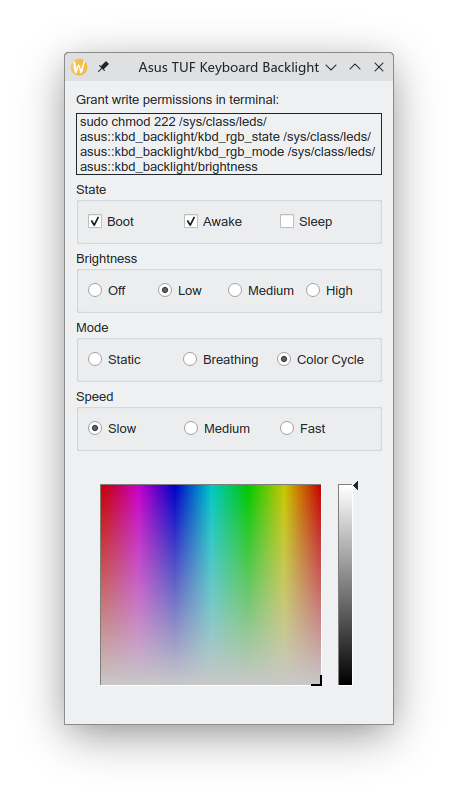

# Asus TUF Linux Keyboard Backlight Control

This is a simple application to control the keyboard backlight of Asus TUF Gaming laptops. It uses the `asus-nb-wmi` kernel module to control the backlight.

This was written just for fun in one night. I recommend using the [terminal commands](https://gist.github.com/llybin/4740e423d8281d839ef013b6cc93db7f).

